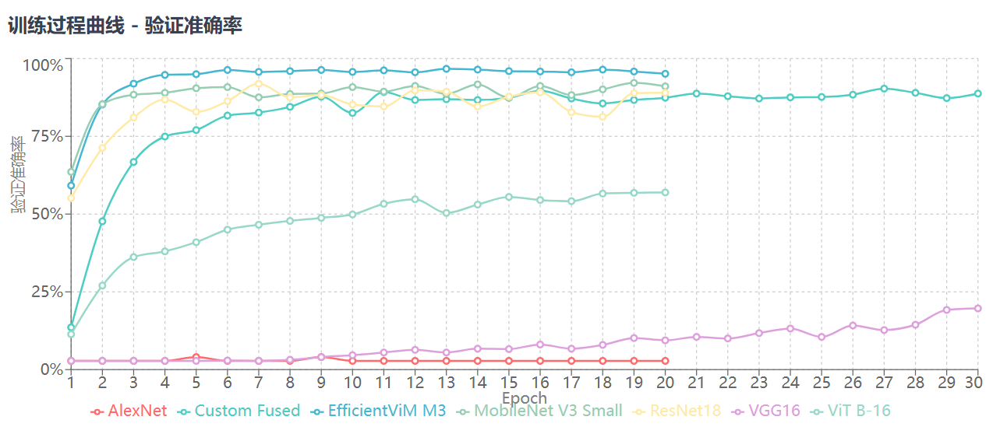
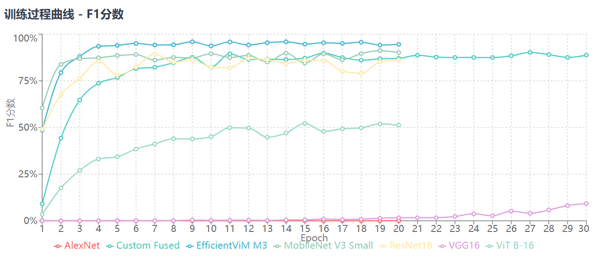

本项目是基于AI的花卉分类识别系统。
### 训练模型文件在train.py中
### 前端页面后端在templates文件加和predict_web.py中
### CVPR论文
### CVPR2025
[EfficientViM](https://arxiv.org/abs/2411.15241)
### CVPR2022
[ConvNext](https://arxiv.org/abs/2201.03545)
### 验证准确率

### 验证F1score

### 分类系统实现

